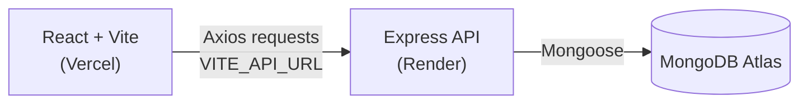
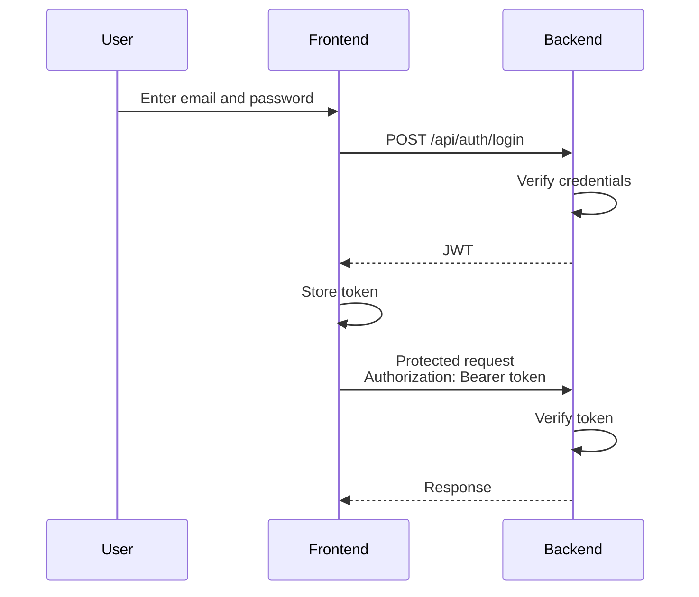
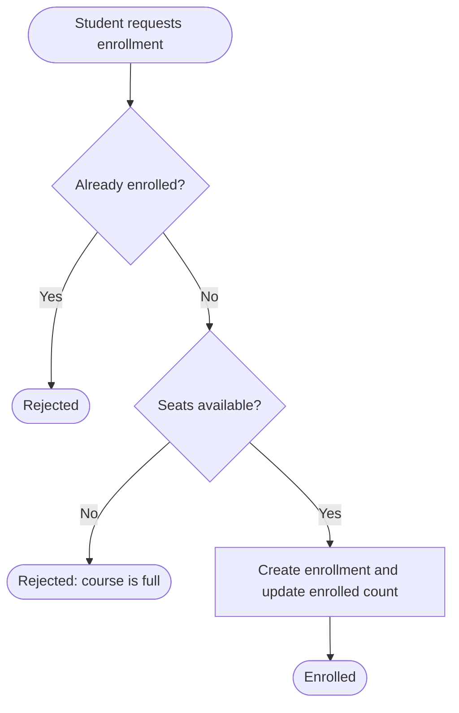

<div align="center">


<br/>

<a href="https://student-course-enrollment-node.vercel.app"></a>
<a href="https://student-course-enrollment-node.onrender.com"></a>

<br/><br/>


<br/><br/>

[Overview](#-overview) · [Features](#-features) · [How It Works](#-how-it-works) · [API](#-api-reference) · [Setup](#-installation--setup) · [Deployment](#-deployment)

</div>

---

## 📖 Overview

**Student Course Enrollment System** is a full-stack web application for managing students, courses, and course enrollments.

Students can register, browse courses, check available seats, and enroll. Admins can manage the course catalog and see every enrollment on the platform. The frontend is built with React and Vite, the backend is a Node.js and Express REST API, and the data lives in MongoDB Atlas.

| | Link |
|:---|:---|
| 🌐 Frontend | https://student-course-enrollment-node.vercel.app |
| ⚡ Backend | https://student-course-enrollment-node.onrender.com |
| 🔗 Production API | https://student-course-enrollment-node.onrender.com/api |

---

## ✨ Features

<table>
<tr>
<td width="50%" valign="top">

### 👩‍🎓 Student

- Registration and login
- JWT authentication
- View courses
- View available seats
- Enroll in courses
- View enrollment status
- Duplicate enrollment prevention
- Seat-limit validation
- Logout

</td>
<td width="50%" valign="top">

### 🛠️ Admin

- Admin login
- Admin dashboard
- View total students, admins, courses, and enrollments
- Create, edit, and delete courses
- View all student enrollments
- Course statistics
- Logout

</td>
</tr>
</table>

---

## 🧰 Tech Stack

| Layer | Technology |
|:---|:---|
| Frontend | React.js, Vite, JavaScript, CSS |
| Backend | Node.js, Express.js |
| Database | MongoDB Atlas with Mongoose |
| Authentication | JWT, bcryptjs |
| API Requests | Axios |
| Version Control | Git & GitHub |
| Deployment | Vercel (frontend), Render (backend) |

---

## 📁 Project Structure

```bash
student-course-enrollment(Node)/
│
├── backend/
│   ├── config/
│   ├── controllers/
│   ├── middleware/
│   ├── models/
│   ├── routes/
│   ├── server.js
│   ├── package.json
│   └── .env                # not committed
│
└── frontend/
    └── frontend/
        ├── src/
        │   ├── pages/
        │   │   ├── Login.jsx
        │   │   ├── Register.jsx
        │   │   ├── Dashboard.jsx
        │   │   └── Admin.jsx
        │   ├── services/
        │   │   └── api.js
        │   ├── App.jsx
        │   ├── App.css
        │   └── index.css
        ├── public/
        ├── package.json
        └── vercel.json
```

---

## 🔐 How It Works

### Architecture



The frontend talks to the backend through Axios (see `src/services/api.js`). The base URL comes from the `VITE_API_URL` environment variable, so the same code works locally and in production.

### JWT Authentication



Protected requests send the token in the `Authorization` header:

```
Authorization: Bearer <token>
```

### Role-Based Access

| Role | Lands on | Can do |
|:---|:---|:---|
| Student | Student Dashboard | Browse courses, enroll, view own enrollments |
| Admin | Admin Dashboard | Manage courses, view statistics and all enrollments |

Admin-only operations are protected by authentication middleware plus admin authorization middleware on the backend.

### Enrollment Validation



Before creating an enrollment, the backend checks whether the student is already enrolled and whether seats are still available. If the student is already enrolled or the course is full, the request is rejected. Otherwise the enrollment is created and the course's enrolled count is updated.

---

## 🗄️ Database

MongoDB Atlas stores three main collections, defined as Mongoose models:

| Model | Purpose |
|:---|:---|
| **User** | Student and admin accounts, with a hashed password and a role |
| **Course** | Course code, title, instructor, seat limit, and enrolled student count |
| **Enrollment** | Links a student to a course and tracks the enrollment status |

---

## 🔌 API Reference

Base URL (local): `http://localhost:4000/api`
Base URL (production): `https://student-course-enrollment-node.onrender.com/api`

### Authentication

| Method | Endpoint | Description |
|:---:|:---|:---|
| `POST` | `/api/auth/register` | Register a new student |
| `POST` | `/api/auth/login` | Log in and receive a JWT |

### Courses

| Method | Endpoint | Description |
|:---:|:---|:---|
| `GET` | `/api/courses` | Get all courses |
| `POST` | `/api/courses` | Create a course (admin) |
| `PUT` | `/api/courses/:id` | Update a course (admin) |
| `DELETE` | `/api/courses/:id` | Delete a course (admin) |

### Enrollments

| Method | Endpoint | Description |
|:---:|:---|:---|
| `POST` | `/api/enrollments` | Enroll in a course |
| `GET` | `/api/enrollments/my` | Get the logged-in student's enrollments |

### Admin

| Method | Endpoint | Description |
|:---:|:---|:---|
| `GET` | `/api/admin/statistics` | Dashboard statistics |
| `GET` | `/api/admin/enrollments` | View all student enrollments |

---

## 🚀 Installation & Setup

### Prerequisites

- Node.js (v18 or later recommended)
- npm
- A MongoDB Atlas cluster and connection string
- Git

### 1. Clone the repository

Clone the project to your machine and open the project folder.

### 2. Install backend dependencies

```bash
cd backend
npm install
```

### 3. Install frontend dependencies

```bash
cd frontend/frontend
npm install
```

---

## 🔑 Environment Variables

> ⚠️ Never commit `.env` files to GitHub. Keep them in `.gitignore` and never put real credentials in the README, issues, or screenshots.

**Backend** (`backend/.env`)

```env
PORT=4000
MONGO_URI=your_mongodb_connection_string
JWT_SECRET=your_secure_jwt_secret
JWT_EXPIRES_IN=1d
```

**Frontend** (`frontend/frontend/.env`)

```env
VITE_API_URL=http://localhost:4000/api
```

For production (set on Vercel):

```env
VITE_API_URL=https://student-course-enrollment-node.onrender.com/api
```

| Variable | Description |
|:---|:---|
| `PORT` | Port the backend runs on locally |
| `MONGO_URI` | MongoDB Atlas connection string |
| `JWT_SECRET` | Secret used to sign and verify JWTs |
| `JWT_EXPIRES_IN` | How long a token stays valid |
| `VITE_API_URL` | Backend API base URL used by the frontend |

---

## 💻 Running Locally

Start the backend:

```bash
cd backend
npm start
```

The API runs at `http://localhost:4000`.

Start the frontend in a second terminal:

```bash
cd frontend/frontend
npm run dev
```

Vite prints the local frontend URL in the terminal (usually `http://localhost:5173`).

---

## ☁️ Deployment

### Frontend: Vercel

| Setting | Value |
|:---|:---|
| Root Directory | `frontend/frontend` |
| Framework | Vite |
| Build Command | `npm run build` |
| Output Directory | `dist` |
| Environment Variable | `VITE_API_URL=https://student-course-enrollment-node.onrender.com/api` |

The included `vercel.json` handles routing for the single-page app.

### Backend: Render

| Setting | Value |
|:---|:---|
| Root Directory | `backend` |
| Build Command | `npm install` |
| Start Command | `npm start` |
| Environment Variables | `MONGO_URI`, `JWT_SECRET`, `JWT_EXPIRES_IN` |

### Database: MongoDB Atlas

Create a cluster, add a database user, and allow network access from Render. Use the connection string as `MONGO_URI`.

> 💡 On Render's free tier the backend may take a few seconds to wake up after being idle.

---

## 🧪 Testing

Testing is done manually. A quick checklist:

- Register a student, log in, and confirm a token is returned
- Call protected routes with and without a valid token
- Create, edit, and delete a course as an admin
- Confirm a student cannot access admin routes
- Enroll in a course, then try again to confirm duplicates are rejected
- Fill a course to its seat limit and confirm further enrollments are rejected
- Check the admin dashboard statistics and the all-enrollments view

API routes can be tested with Postman or Thunder Client.

---

## 🛡️ Security Notes

- Passwords are hashed with bcryptjs and never stored in plain text.
- Protected routes require a valid JWT.
- Admin routes use authentication plus admin authorization middleware.
- Secrets and connection strings are kept in environment variables.
- `.env` files must not be committed to GitHub.

---

## 🔮 Future Improvements

These are ideas, not current features:

- Course search and filtering
- Email notifications
- Student profile
- Password reset
- Advanced analytics
- Real-time notifications

---

## 📄 License

This project is licensed under the MIT License.

---

<div align="center">

**Made by Pawan Mishra**

</div>
